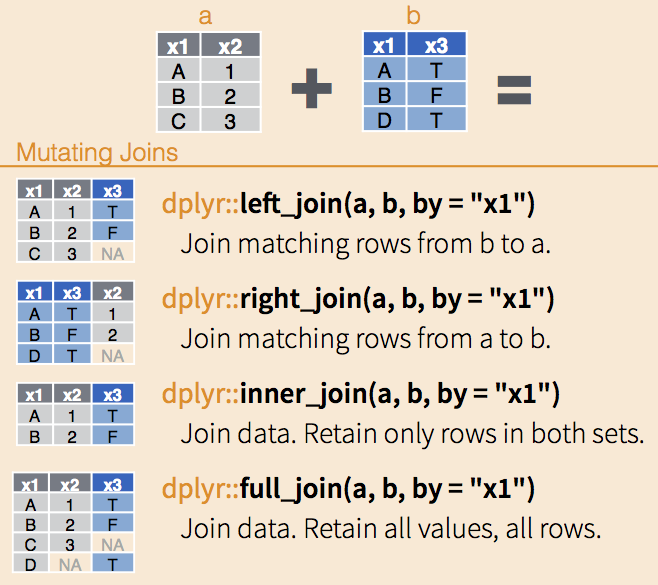

# Data wrangling with the tidyverse for linguists

```{r}
knitr::include_graphics("img/tidyverse_celestial.png")
```

The tidyverse is an extremely useful collection of R *packages* (i.e. add-ons to *base-R*)

If you've never used it before (or if it's been a while), install/update the package in the console with `install.packages("tidyverse")` or in the Packages pane on the right --\>

Remember to load the package in any script you want to use it in:

```{r}
library(tidyverse)
```

# What is data wrangling?

**Wrangling is getting your data into whatever shape you need for later analysis & graphing, including...**

-   Give more informative (or shorter, easier to type) names to your columns

-   Change the measurement of the column (e.g., convert from milliseconds to seconds, or normalize frequency)

-   Drop columns that you don't need

-   Subset the data so only participants who completed the entire questionnaire are kept ...or subset to only the country/region of interest ...or subset to only the experimental items (no practice or filler sentences)

-   Change factor level names (i.e. if you have education labeled as 1, 2, 3 and you want it to read "Elementary School", High School", "University")

-   Add or change values based on some logic (e.g., evaluate whether a participant's answers were correct or incorrect)


**Why not just do it in Excel?**

-   Takes a lot longer

-   Sometimes isn't possible/would take ages

-   Is prone to errors

-   Isn't reproducible (if you collect more data or later have similar datasets)
    

**Reminder/Mindset:**

- You don't have to know by heart what any of the functions are called and how they work

- You can look them up/Google them/copy them from this file or one of your old scripts

- The goal is that you're familiar with what's possible and the general logic behind the functions


```{r}
knitr::include_graphics("img/dplyr_wrangling.png")
```

Image by @allison_horst

# First: R-Markdown

This is an R-Markdown file (.Rmd)

Anything in the blank space is interpreted as *text*, like comments in an R-script.

Code has to go in code blocks:

```{r}

```

Insert them with the green + and c in the top right corner.

Note that the code block has three backticks ``` at the start and the end. If one of these gets deleted, you might experience weird errors!

To run code in a code block, click the green arrow.

```{r}
3 + 4
```

The output will show up below the block.

To save an output, assign it to a variable name using the assignment operator `<-`.

```{r}
my_age <- 1
```

Update the value, then re-run the segment to see your variable change in the environment tab.

# The datasets

Let's read in a self-paced reading dataset using `read_csv` --> because the file is saved as .csv

It's saved in a sub-folder called "data" that is located *within the same folder* as this file, so we need to add `data/`

```{r}
spr_catdog <- read_csv("data/spr.csv")
```

The current dataframe is a self-paced reading experiment (SPR) where 12 participants read 20 sentences each, plus 3 practice sentences. In a SPR experiment, participants see one word at a time and need to press a button to be shown the next word in the sentence. Their reaction times (RTs, i.e. how long it takes them to press that button) are recorded.

```{r}

```

Half the sentences were about dogs and half the sentences were about cats. In one condition (A), all sentences were paired with common adjectival collocates according to the BNC (lap dog vs. tortoiseshell cat), in the other (B), these were reversed so that "cat-related" words were paired with the word "dog", and vice versa (lap cat vs. tortoiseshell dog). All sentences were presented in otherwise natural-sounding sentences.

Now you have a data file read in, but how do you see what's in it?

```{r}
head(spr_catdog)
```

You can change the amount of rows you see with the `n` *argument*:

```{r}
head(spr_catdog, n=3)
```

Or: Click on the name of dataframe in the Environment tab (top right) to open a preview in a new tab. You can also sort columns and filter rows (just for viewing purposes). If the dataframe is large, however, this can get very slow.

There's also an easy way to see what the columns are:

```{r}
colnames(spr_catdog)
```

You can also use `summary()`: call it on a dataframe to get each column and useful info based on the data type. For example, numeric columns will show the min, median, max and the quartiles (25% increments).

```{r}
summary(spr_catdog)
```

We will also be using another dataset today, primarily for the exercises. Read it in:

```{r}
ELP <- read_csv("data/ELP_pos.csv")
```

This dataset includes the average reading times for various words, as well as their frequency (from an English subtitle corpus, here called SUBTL), their part of speech, and length in characters.

Take a moment to use some of the commands above to take a look at the dataframe:

```{r}

```

# The pipe %>%

One of the most noticeable features of the tidyverse is the pipe %\>% (keyboard shortcut: Ctrl/Cmd + Shift + M).

The pipe takes the item before it and feeds it to the following command as the first argument. Since all tidyverse (and many non-tidyverse) functions take the dataframe as the first argument, this can be used to string together multiple functions. It also makes it easier to read sequential code in a more natural order.

Compare the following lines of pseudocode (courtesy of @andrewheiss), which would produce the same output:

```{r}
knitr::include_graphics("img/pipe_andrewheiss.jpg")
```

You can see that the version with the pipe is easier to read when more than one function is called on the same dataframe. In a chain of commands like this one, you can think of the pipe as meaning "and then".

So to re-write the `head()` function with the pipe:

```{r}
spr_catdog %>% 
  head()
```

This produces the exact same output as `head(spr_catdog)`.

Here are some more examples:

```{r}
# Equivalent to summary(spr_catdog)
spr_catdog %>% 
  summary()

# Equivalent to colnames(spr_catdog), which returns all column names
spr_catdog %>% 
  colnames() 

# Equivalent to nrow(spr_catdog), which returns the number of rows in the df
spr_catdog %>% 
  nrow()
```

You can also stack commands by ending each row (except the last one) with a pipe.

```{r}
spr_catdog %>% 
  colnames() %>% #extracts column names
  nchar() #counts the number of letters
```

You can see that the version with the pipe is easier to read when more than one function is called on the same dataframe. The line breaks are optional, but make the code more readable.

## Try it

(1) Rewrite the following command using pipes: `ncol(ELP)`. What does it show?

```{r}

```

(2) Rewrite the following command using a pipe: `head(ELP, n = 8)`. What does it show?

```{r}

```

# Renaming and rearranging data

## rename()

You can rename columns with the `rename()` function. The syntax is new_name = old_name. Let's rename the `cond` variable:

```{r}
spr_catdog %>% 
  rename(condition = cond)
```

### Preview vs. saving

This is just a preview because we didn't assign the changed dataframe to any name. If you look at the spr_catdog dataframe, for example in the Environment panel on the upper-right, the dataframe hasn't changed. This is useful for testing code and making sure it does what you expect and want it to do. To save the changes, we need to assign the call back to the variable name, i.e.

dataframe <- dataframe %>%
some operations here

### Renaming multiple columns

You can also rename multiple columns at once:

```{r}
spr_catdog <- spr_catdog %>% 
  rename(condition = cond, 
         sentence = full_sentence)
```

Notice above that we've saved output over the spr_catdog dataframe to make the changes 'permanent'.

There is no output when you save the changes, but the spr_catdog dataframe has been permanently updated (within the R session, not in your file system). To save the changes, but also show the output of a function, we can put brackets around the code.

If you make a mistake: arrow with a line under it in the code block of R-Markdown, runs all blocks above (but not the current one).

# Subsets

Taking a subset allows you to look at only a part of your data: tidyverse uses `select()` for columns and `filter()` for rows.

## select()

Use `select()` to extract a subset of one or several columns:

```{r}
spr_catdog %>% 
  select(RT) 
```

You can also use `select()` to extract multiple columns.

```{r}
spr_catdog %>% 
  select(participant, word, RT)
```

You can see that these columns are presented in the order you gave them to the select call, too:

```{r}
spr_catdog %>% 
  select(RT, word, participant)
```

You can also use this to reorder columns in that you give the name of the column(s) you want first, then finish with `everything()` to have all other columns follow:

```{r}
spr_catdog %>% 
  select(RT, everything())
```

### Remove columns with select

You can also remove columns using select if you use the minus sign. For example, the item_type column is a factor with only one level - it always says "DashedSentence". So let's get rid of it:

```{r}
spr_catdog %>% 
  select(-item_type)
```

You can also remove multiple columns at once by writing them in a vector `c()`. We'd like to remove the item type column and also the first column (X1) which seems to be just a counter.

```{r}
spr_catdog <- spr_catdog %>% 
  select(-c(item_type, X1))
```

This overwrites the data as it is saved in R. It does **not** overwrite the file that is saved on your computer.

### Try it

(1) Return only the columns containing word, part of speech, and mean RT from the ELP data.

```{r}

```

(2) Challenge: Consult the documentation for `select()` by calling `?select`. How could you use a colon to return just the word, length, and SUBTLWF columns?

```{r}

```

## filter()

`filter()` lets you look for **rows** that fulfill certain conditions.

```{r}
knitr::include_graphics("img/dplyr_filter.png")
```

Image by @allison_horst

Use `filter()` to return all items that fit a certain condition. For example, you can use:

- equals: `==`

- not equal to: `!=`

- greater than: `>`

- greater than or equal to: `>=`

- less than: `<`

- less than or equal to: `<=`

- in (i.e. in a vector): `%in%`

Let's look at reaction times that are shorter than 200 ms:

```{r}
spr_catdog %>% 
  filter(RT < 200)
```

...reaction times longer than or equal to 250 ms:

```{r}
spr_catdog %>% 
  filter(RT >= 250)
```

Or you can use it to select all items in a given category. Notice here that you have to use quotation marks to show you're matching a character string.

Look at the error below:

```{r eval=FALSE}
spr_catdog %>% 
   filter(condition == condA)
```

The correct syntax is: (because you're matching to a string)

```{r}
spr_catdog %>% 
  filter(condition == "condA")
```

You can also use filter to easily drop rows. Let's drop all practice rows and save the output.

```{r}
nrow(spr_catdog)

spr_catdog <- spr_catdog %>% 
  filter(condition != "practice")

nrow(spr_catdog)
```

It's useful to check `nrow()` before and after dropping rows to check how much data has been lost.

To use %in%, give an array of options (formatted in the correct way based on whether the column is a character or numeric):

```{r}
spr_catdog %>% 
  filter(word %in% c("cat", "dog"))

spr_catdog %>% 
  filter(sentence_num %in% c(4, 14))
```

Note that filter is case-sensitive, so capitalization matters.

We can also specify several conditions in one `filter()` call:

- Use `&` for "and" (both conditions must be true)

- Use `|` for "or" (one condition must be true)

```{r}
spr_catdog %>% 
  filter(word == "cat" & RT > 300) # the word has to be cat AND the reaction time has to be higher than 300

spr_catdog %>% 
  filter(RT > 600 | RT < 100) # the reaction time has to be bigger than 600 OR smaller than 100
```

### Try it

(1) Filter the ELP data to just words that have a frequency of at least
    100. 

```{r}

```

(2) Then filter ELP to just words of frequency of at least 100 that are nouns (NN in the POS column). Don't overwrite the original data frame!

```{r}

```

(3) Challenge: Filter the ELP dataset to only include words that are in the spr_catdog\$Word column (it isn't many!)

```{r}

```

## distinct()

We can also "chain" different functions, which is one of the things that makes the pipe so useful. For example, we could filter for data in condition B and only look at the words and their response times:

```{r}
spr_catdog %>% 
  filter(condition == "condB") %>% 
  select(word, RT)
```

One useful function that can be chained to `filter()` is `distinct()`, which will return only the unique rows. Without an argument, it returns all rows that are unique in all columns.

You can also add a column name as an argument to return only the unique values in a certain column

```{r}
spr_catdog %>% 
  filter(condition == "condB") %>% 
  distinct(sentence)
```

You can also use it on its own to return unique values or combinations of values.

```{r}
spr_catdog %>% 
  distinct(sentence, condition)
```

But note that you need to add the argument `.keep_all = TRUE` if you want to see all other columns, not just those listed directly in the `distinct()` call

```{r}
spr_catdog %>% 
  filter(condition == "condB") %>% 
  distinct(sentence, condition, .keep_all = TRUE) #Some of these values are nonsense, but say we need to keep sentence_num 
```

### Try it

(1) Filter the ELP dataset to all rows where the mean RT is greater than or equal to 1000ms

```{r}

```

(2) Filter the spr_catdog data to just the rows that have the value "cat" in the word column. Then, return the distinct sentences that include the word cat.

```{r}

```

(3) Challenge: Filter the ELP dataset to all four letter nouns (NN)

```{r}

```

# Creating and changing columns with mutate()

With the `mutate()` function, you can change existing columns and add new ones. The syntax is: data %>% mutate(col_name = some_operation)

```{r}
knitr::include_graphics("img/dplyr_mutate.png")
```

Image by @allison_horst

The response times are measured in ms. Let's convert them to seconds by dividing by 1000:

```{r}
spr_catdog %>% 
  mutate(RT_s = RT / 1000)
```

Now, there's a new column called RT_s (it's at the very end by default).

You can also save the new column with the same name, and this will update all the items in that column (see below, where I add 1000 to each RT, but note that I don't save the output):

```{r}
spr_catdog %>% 
  mutate(RT = RT + 1000)
```

You can also do operations to character columns - for example:

```{r}
(spr_catdog <- spr_catdog %>% 
  mutate(word = tolower(word)))
```

We can also easily calculate the length of each word (as number of characters):

```{r}
(spr_catdog <- spr_catdog %>% 
  mutate(word_length = nchar(word)))
```

Another example: the `round()` function rounds numbers to a specified number of digits:

```{r}
round(3.4567, digits = 1)

round(3.4567, digits = 2)

round(3.4567, digits = 0)
```

We can use it within `mutate()` to round all numbers on one or several columns:

```{r}
ELP %>% 
  mutate(SUBTLWF = round(SUBTLWF, digits = 1),
         Mean_RT = round(Mean_RT, digits = 0))
```

## Change data type in a column

We can also change data types using `mutate()`.

```{r}
(spr_catdog <- spr_catdog %>% 
  mutate(participant = as_factor(participant),
         condition = as_factor(condition)))
```

As you can see, we can change several variables within one `mutate()` call. In the same way, we could create several new columns at the same time.

Relabeling these columns as factors has some benefits (and is necessary for some analysis types). One example is a more informative `summary()` output:

```{r}
summary(spr_catdog)

summary(spr_catdog$participant)
```

## Relabel factors

In our spr_catdog experiment, condition A represents a match (i.e. cat/dog is presented with a matching collocate: purring cat, guide dog) and condition B is a mismatch (e.g. guide cat, purring dog). To make this clear in the data, we should label this explicitly. Within a `mutate()` command, we can use `recode()` to change the factor labels. The format for this is "old label" = "new label".

```{r}
(spr_catdog <- spr_catdog %>% 
  mutate(condition = recode(condition, 
                            "condA" = "match", 
                            "condB" = "mismatch")))
```

## Change columns using logic with case_when()

`case_when()` allows you to use logical statements to change data in a column.

You can use the same logical operators as you do for `filter()`, i.e.: - equals to: == - not equal to: != - greater than: > - greater than or equal to: >= - less than: < - less than or equal to: <= - in (i.e. in a vector): %in%

```{r}
knitr::include_graphics("img/dplyr_case_when.png")
```

Image by @allison_horst

The syntax within `case_when()` is:

condition ~ what to do if it is true,

optionally another condition ~ what to do if this is true,

TRUE ~ what to do in all other cases.

`case_when()` has to be nested inside a `mutate()` call to make changes to a column:

Let's try it on a categorical column using %in%

```{r}
spr_catdog <- spr_catdog %>% 
  mutate(position = case_when( # make a new column named position
    word %in% c("cat", "dog") ~ "critical", # if the word column says cat or dog, write critical 
    TRUE ~ "not critical") # in all other cases, write not critical into the position column
    )

# select is useful to check if this worked correctly
spr_catdog %>% 
  select(word, position)
```

As another example, let's try "dichotomizing" response time, i.e. turning them into a categorical variable (note that this is not recommended!):

```{r}
spr_catdog <- spr_catdog %>% 
  mutate(RT_categorical = case_when(
    RT < 100 ~ "short", 
    TRUE ~ "long"
  ))
```

We could also add another condition (or as many as you want!)

```{r}
spr_catdog <- spr_catdog %>% 
  mutate(RT_categotical = case_when(
    RT < 100 ~ "short",
    RT > 500 ~ "long",
    .default = "normal"
  )) 
```

Other uses of case_when():

- evaluating participants' answers as correct or incorrect

- simplify a column (e.g., simplify people's occupations into student or not student)

- classify transcription attempts as same length as correct answer, longer, shorter

### Try it

(1) Challenge: Take the word_num column of spr_catdog. This shows the position the word had in the sentence, where the first word of the sentence is 1, the second word is 2, and so on. Use a case_when statement to make a new column called word_num_cat and dichotomize the variable into three conditions: "beginning" for the first 3 words, "middle" for words # 4 - 7 and "end" for anything else.

```{r}

```

(2) Challenge: Using the ELP dataset, first make a new column entitled "freq_nouns" with the condition that it lists "frequent noun" for all entries that are both nouns and have a SUBTL frequency above 50. Then, create a new dataset entitled "ELP_freq_nouns" with ONLY these frequent nouns.

```{r}

```

# Separate

For the next two examples, we'll use a new dataset, called animal_corpus. Let's take a look:

(If you are wondering why we are using `read_csv2()`, it's because this dataset is semicolon separated!)

```{r}
animal_corpus <- read_csv2("data/cat_dog_corpus_data.csv")

head(animal_corpus)
```

This contains corpus data of "cat" and "dog" together with the words that precede "cat" and "dog". These are called "collocates" and, in our example, also include part of speech tags (the format is word_tag).

## separate()

However, the collocate and the POS are in the same column.

The command we need here is: `separate()`. It takes the following arguments:

- data: our dataframe, we'll pipe it

- col: which column needs to be separated

- into: a vector that contains the names of the new columns

- sep: which symbol separates the values

- remove (optional): by default, the original column will be deleted. Set to FALSE to keep it.

```{r}
animal_corpus %>% 
  separate(col = collocate, 
           into = c("coll", "POS"), # more than two columns is also possible
           sep = "_")
```

By default, the input column is deleted, but we can add a line to keep it:

```{r}
animal_corpus %>% 
  separate(col = collocate, 
           into = c("coll", "POS"), 
           sep = "_",
           remove = FALSE)
```

Let's overwrite the original "untidy" data frame with the new tidy version:

```{r}
animal_corpus <- animal_corpus %>% 
  separate(col = collocate, 
           into = c("coll", "POS"), 
           sep = "_")

animal_corpus
```

## Reshaping data: pivoting

Let's look into how to change the shape of your data. There are two options here:

- making your data "longer", i.e. increase the number of rows and decrease the number of columns: `pivot_longer()`

- making your data "wider", i.e. decrease the number of rows and increase the number of columns - not (as) common for tidying but for creating summary tables: `pivot_wider()`

### pivot_longer()

Let's take another look at some questionnaire data. The df rec_survery contains four participants who each listened to four recordings and tried to transcribe what they heard as accurately as possible.

```{r}
rec_survey <- read_csv2("data/recordings_survey.csv")
```

The data from each person is represented on one line. The columns rec1 to rec4 contain the transcription scores (which range from 0 = completely wrong to 1 = completely accurate).

```{r}
rec_survey %>% 
  head()
```

Here, the issue is that the transcription scores are spread across four different columns. For many graphing and modeling purposes, though, we would need a column (which we'll call "recording"), which identifies the recording and contains either rec1, rec2, rec3, or rec4, and another column that contains the score.

The basic `pivot_longer()` arguments are:

- cols: which columns should be reshaped?

- names_to: what to name the column that will contain what is now the column names

- values_to: what to name the column that will contain what is now in the cells

You can always try it without using the `names_to` and `values_to` arguments first, and then pick the names after you look at the preview!

```{r}
rec_survey %>% 
  pivot_longer(cols = c("rec1", "rec2", "rec3", "rec4"))
```

```{r}
rec_survey %>% 
  pivot_longer(cols = c("rec1", "rec2", "rec3", "rec4"),
               names_to = "recording",
               values_to = "score")
```

The `cols` argument accepts "select syntax", i.e. anything that works in `select()` like `starts_with()`, `:`, `-`, etc.

Because pivoting represents a major change compared to the original data frame, it's often a good idea to save it under a different name:

```{r}
rec_survey_long <- rec_survey %>% 
  pivot_longer(cols = rec1:rec4,
               names_to = "recording",
               values_to = "score")

rec_survey_long
```

Another example: This next file contains the averages of acceptability judgements for the sentences we used in the experiment (we'd expect that sentences which contain mismatching collocates such as "barking cat" are rated as less acceptable than sentences with matching collocates).

```{r}
acc_judge_original <- read_csv("data/acceptability_judgements.csv")

acc_judge_original %>% 
  head()
```

We can see that this data is in a very wide format - each column name contains one of the sentences, and the only row consists of the average acceptability judgements. Even this dataset can be saved!

What we'd like instead is a column that contains all the sentences and another column that contains all the averages. The command `everything()` will be very useful here!

```{r}
(acc_judge <- acc_judge_original %>% 
  pivot_longer(
    cols = everything(), # we want to reshape the entire data, so all variables are concerned
    names_to = "sentence",
    values_to = "rating"
  ))
```

### pivot_wider()

While `pivot_longer()` is often used to tidy data, its opposite `pivot_wider()` is more common when creating and reformatting summary tables. For example, let's read in a summary table of "cat" and "dog" with the frequencies of their collocates:

```{r}
animal_corpus <- read_csv2("data/cat_dog_collocates.csv")

animal_corpus
```

Next, we'd like to reshape this data into a more typical contingency table-like format, with "cat" and "dog" as row labels, and the collocates as column labels.

We can use `pivot_wider()` to achieve this. Its main arguments are:

- names_from: where should the new column names come from?

- values_from: where should the corresponding values come from?

```{r}
animal_corpus  %>% 
  pivot_wider(
    names_from = coll,
    values_from = n
  )
```

We can also take those unattested occurrences and fill the NAs with 0s.

```{r}
animal_corpus  %>% 
  pivot_wider(
    names_from = coll,
    values_from = n,
    values_fill = 0
  )
```

Both `pivot_longer()` and `pivot_wider()` have a range of additional options in case your data looks like it needs pivoting, but the default settings don't quite work. Have a look at the vignette: <https://tidyr.tidyverse.org/articles/pivot.html>

# Joining tables

Back to the self-paced reading data:

```{r}
head(spr_catdog)
```

We have averages of acceptability judgements for the sentences we used in the experiment in one of the files we read in and pivoted earlier. We'd expect that sentences which contain mismatching collocates such as "barking cat" are rated as less acceptable than sentences with matching collocates.

```{r}
acc_judge
```

Ideally, we want this information to be in the same data frame as the self-paced reading data. Let's add the acceptability judgement data to the SPR data: we want to "join" the two datasets into one, so each sentence should be matched up with its average rating.

There are several join commands, which differ in how they match up datasets and which cases are kept or discarded.

Their syntax is: xxxx_join(dataframe1, dataframe2, by = "column that is present in both dfs")

```{r}

```

The column "sentence" is what we need to match up acceptability judgements with the SPR data.

I'll use left_join, because if the sentence doesn't show up in the spr_catdog dataset, we don't need the rating! A full_join would also be a safe option: this would leave an empty row with just the sentence and rating if there is one missing from the spr_catdog data

```{r}
left_join(spr_catdog, acc_judge, 
                     by = "sentence") # which column should be used to match up the two data frames?
```

If you don't specify the variable, R will check if there's a variable with the same name in both data frames:

```{r}
left_join(spr_catdog, acc_judge)
```

When joining, it's often a good idea to create a new dataframe instead of overwriting any of the old ones.

```{r}
spr_acc <- left_join(spr_catdog, acc_judge, 
                     by = "sentence")
```

A quick glance at the Environment tab confirms that we now have a dataframe with the same number of rows ("observations") but one more column, just as we want. But when joining data, plenty of things can go wrong, so let's look at the data:

```{r}
spr_acc %>% 
  select(sentence, rating) %>% 
  distinct()
```

Looks good!

As a final example, we'll read in one last, very simple, dataset. It contains the raw frequencies of each of the words participants read in the SPR experiment (word frequency tends to be a good predictor of reading times: more common words are usually read faster). Let's have a look:

```{r}
corpus_frequencies <- read_tsv("data/corpus_frequencies.txt")

head(corpus_frequencies)
```

We'd like to add the word frequency to our data, so the column to match by is "word" in the spr data but it's called "token" in the corpus data. To join this, we can either rename one of these or use a vector in `by()` which lists the two column names as they appear in the dataframes:

Syntax: add the argument by = c("colname_df1" = "colname_df2")

```{r}
spr_acc_freq <- full_join(spr_acc, corpus_frequencies, by = c("word" = "token"))

spr_acc_freq
```

If the join worked as intended, we can remove the input data frames to declutter our Environment:

```{r}
rm(spr_acc, corpus_frequencies)
```

Other options:

- `bind_rows()` to combine data frames rowwise

- `bind_cols()` to combine data frames columnwise

## Try it

(1) Take a look at the following dataset which contains more information on the participants in the SPR experiment and join it the spr_acc_freq data. Save the new dataset as spr_full

```{r}
animal_survey <- read_csv("data/animal_survey.csv")
animal_survey

spr_acc_freq 
```

# Exporting data

We've added a few new columns to our data, which contain the transformed variables. We might want to export this and save it to, e.g., a csv file to read back in later.

To write files to disk, you also need to select which separator you want to use (commas, semicolons, or tabs).

CSVs are often saved as .csv (this is also openable in Excel) and TSVs are often saved as .txt

You can save CSVs and TSVs like so:

-   `write_csv(df, "name_df.csv")` comma-separated

-   `write_csv2(df, "name_df.csv")` semicolon-separated

-   `write_tsv(df, "name_df.txt")` tab-separated

Make sure to not overwrite the original file! Pick a different name:

```{r}
write_csv(spr_acc_freq, "data/spr_catdog_full.csv")
```

Remember, something like data type in R (ex: character or factor) can't be saved into one of these files -- it just saves the values separated by the separator (and the column names). So you'll still have to do the conversions next time you read the file into R.

# Recap

-   the pipe `%>%` takes the item before it (usually the dataframe) and feeds it to the following command as the first argument -\> allows you to chain several commands in a readable way
-   `rename()` and `arrange()` columns
-   subsets: `select()` to pick column(s), `filter()` to pick rows
    -   conditions with \>, \>=, \<, \<=, ==, !=, %in%
    -   logical operators: and & as well as or \| to use several conditions
-   `distinct()` to keep unique rows
-   `mutate()` to create new columns or change existing columns
    -   change data type
    -   change factor labels
    -   `case_when()` statements: create columns based on data in other columns
-   Two common functions for tidying data are:
    -   `separate()` if you have two variables in one column
    -   `pivot_longer()` if your data is in wide format but needs to be long
-   And `pivot_wider()`
    -   usually not helpful for tidying data but can be useful for reformatting summary and/or contingency tables
-   Joining data from two data frames into one to add additional information
-   Exporting data from R into different file formats

*Note that all these functions have additional arguments and options, so if, in order to clean data, you think you need a function but it doesn't quite work, take a look at the documentation!*
